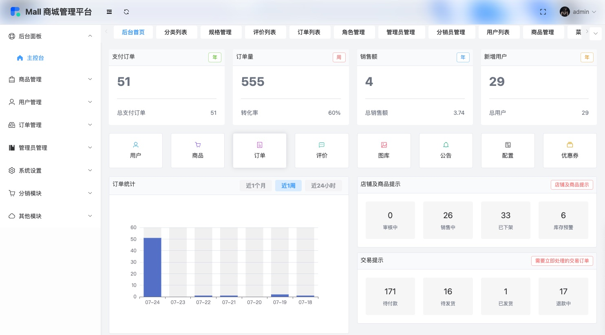

# Mall 商城管理平台


[](https://badge.fury.io/js/overwatch-ui)
[](https://travis-ci.org/Haixiang6123/overwatch-ui)

## Introduction

Mall  商城管理平台集成了主控台、商品管理、用户管理、订单管理、管理员管理、系统设置、分销模块、其他模块等八个模块的相关业务的呈现。主控台模块展示产品，属性等各项指标报表；商品管理模块展示不同的产品详情；用户管理模块负责对不同等级用户的等级操作；订单管理模块呈现不同产品的交易情况和订单信息；管理员模块包含权限管理，⻆⾊管理和人员管理；分销模块负责管理分销人员的信息，展示对应的销量情况；辅助模块例如：图库、公告、交易、物流、评论等模块辅助其他管理的运营操作。

### Built With

[![Vue.js][Vue.js]][Vue.js]<br/>
[![Vite][Vite]][Vite]<br/>
[![Element][Element]][Element]<br/>
[![Github Actions][GithubAction]][GithubAction]<br/>
## Preview


<a href="https://github.com/Xinjn/imgup/issues">Report Bug</a>
·
<a href="https://github.com/Xinjn/imgup/issues">Request Feature</a>




## Install
```bash
$ npm install 
```

## Development

```bash
$ npm run dev
```

## License

Distributed under the MIT License. See `LICENSE.txt` for more information.

[Vue.js]: https://img.shields.io/badge/Vue.js-35495E?style=for-the-badge&logo=vuedotjs&logoColor=4FC08D
[Vue-url]: https://vuejs.org/
[Vite]: https://img.shields.io/badge/Vite-35495E?style=for-the-badge&logo=Vite
[vite-url]: https://vitejs.dev/
[Element]: https://img.shields.io/badge/element-35495E?style=for-the-badge&logo=element
[GithubAction]: https://img.shields.io/badge/Github%20Action-35495E?style=for-the-badge&logo=GitHub+Actions
